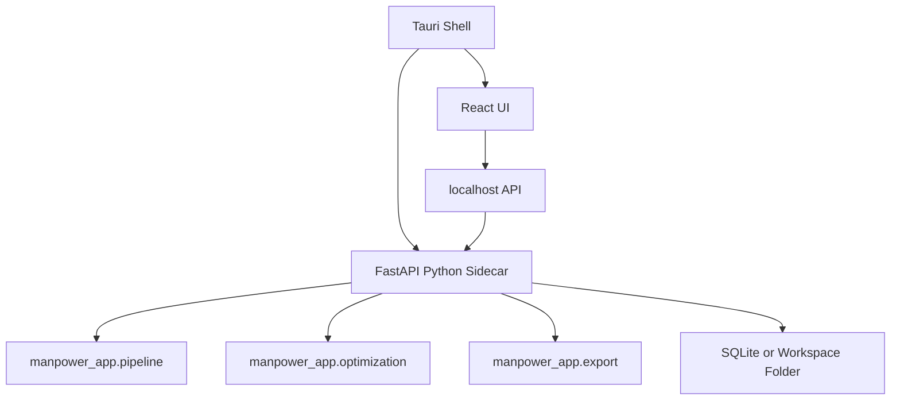

# Future Tauri Architecture

## Target Pattern

The recommended desktop architecture is:

1. Tauri desktop shell for installable app packaging and native OS integration.
2. React frontend for the user interface.
3. Local FastAPI sidecar for Python workflows.
4. `manpower_app` modules reused as the backend service layer.
5. SQLite or an explicit local workspace folder for local state and generated outputs.

## Migration Steps

1. Keep Streamlit as the reference implementation until the business flow is stable.
2. Add a FastAPI wrapper around workbook ingestion, settings, optimization execution, results retrieval, and export generation.
3. Build a Tauri + React shell that calls the local FastAPI service.
4. Bundle the FastAPI backend as a sidecar executable.
5. Create a Windows installer or portable ZIP for pilot delivery.
6. Add code signing and client IT allowlisting for production delivery.

## Packaging Notes

Tauri can bundle external sidecar binaries, but Python packaging must be tested per operating system. Scientific and optimization dependencies such as pandas, openpyxl, and PuLP should be validated in the packaged binary before client release.

## Release Checklist

- Versioned build artifact.
- Checksums.
- No embedded secrets.
- Signed installer for production use.
- Release notes.
- Installation and troubleshooting guide.
- Client IT distribution or allowlisting plan.
